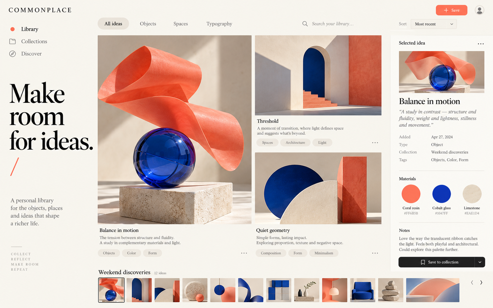

# Frontend Style Discovery

**Choose examples. Explain the parts you like. Turn those choices into an original frontend.**

[中文说明](README.zh-CN.md) · [Step-by-step workflow](docs/WORKFLOW.zh-CN.md) · [Independent example](docs/CASE_STUDY.zh-CN.md)

https://github.com/user-attachments/assets/c3c84a07-ba15-4bec-a6af-64b6108e10b3



A reusable Codex skill for people who know what they like when they see it but cannot describe it upfront. Start with 10–20 real UI references, keep numbered choices across rounds, separate layout from color/material/motion, and compose a complete original design. Continue through implementation when authorized.

It works for collection apps, dense workspaces, editors, dashboards, mobile interfaces and brand sites. It does not prescribe 3D, warm colors or a particular component stack.

## What you get

- A staged discovery workflow and feedback playbook, including rejection, partial approval and resuming work.
- A local selection gallery: search, filter, favorites, reasons, preview, comparison and JSON export/import.
- Python tools to summarize factual choices and assemble another round without reassigning IDs or losing liked references.
- Decision and implementation-handoff templates covering states, responsive behavior and verification.
- A 16-source research starter library, two original **fictional** COMMONPLACE concepts and a reproducible 32-second WebGL film.

The source library contains links with verification labels, not sixteen inspected application screenshots. COMMONPLACE images are original visual concepts, not a connected app or a user's private project. See [the independent walkthrough](docs/CASE_STUDY.zh-CN.md).

## Install and use

Python 3.10+ is enough for the skill and gallery tools. Node is optional for the showcase.

```sh
git clone https://github.com/yanghongliang1010-stack/frontend-style-discovery.git
cd frontend-style-discovery
python3 scripts/install-local.py
```

The installer uses CODEX_HOME/skills (default ~/.codex/skills) and refuses to overwrite an existing skill. Start a new Codex turn/session if discovery has not refreshed.

Example request:

```text
$frontend-style-discovery
I want to redesign an inspiration library, but cannot describe the style.
Find 10–20 different real references for me to choose. Design first.
```

Then you can simply reply with IDs and optional reasons:

```text
I like 3 for the collection layout and 10 for its materials.
None of the dense workspaces fits. Show different collection structures.
```

The skill records which parts were selected and which remain unresolved. Favorites do not automatically approve a final design or development.

## Try the local gallery

```sh
python3 skills/frontend-style-discovery/scripts/build_gallery.py examples/demo.json --output out/gallery
python3 -m http.server 8780 --bind 127.0.0.1 --directory out/gallery
```

Open http://127.0.0.1:8780/ . No model key or Node install is needed. Previews are local files; choices and notes stay in your browser. Export before changing browser/origin. Imports verify project and reference identity; malformed data cannot partially update choices.

## Reproduce the multi-round walkthrough

```sh
python3 skills/frontend-style-discovery/scripts/summarize_choices.py examples/reference-library.json examples/walkthrough/choices.json --output out/preferences.json
python3 skills/frontend-style-discovery/scripts/advance_round.py examples/reference-library.json examples/walkthrough/additions.json --decisions examples/walkthrough/choices.json --output out/round-2
python3 skills/frontend-style-discovery/scripts/build_gallery.py out/round-2/references.json --output out/round-2-gallery
```

The new manifest pins liked references, reserves earlier IDs, relocates local previews and retains original decisions. Existing output directories are protected. For installed use, resolve these scripts relative to the installed SKILL.md, not your app's cwd.

## Showcase, checks and limitations

```sh
npm ci --ignore-scripts
npm run gallery
npm run demo
# open http://127.0.0.1:8782/demo/
```

The film uses original procedural 3D, camera movement and audio. The native page player supports play/pause and seeking. It uses no footage or assets from linked creators. [Video reproduction](docs/VIDEO.md) includes exact commands and requirements.

Run `npx playwright install chromium` and `npm run check` for tool/browser regressions. Read [validation evidence](docs/VALIDATION.md), [behavioral evaluation criteria](docs/EVALUATION.md), and [contributing](CONTRIBUTING.md). A scripted synthetic rehearsal is not independent agent or real-user validation; concept images are not production implementations.

MIT for original code/assets. Reference-site artwork remains its creators' property; see [third-party notices](THIRD_PARTY_NOTICES.md).

Media playback checks use installed Google Chrome (or CHROMIUM_PATH), because bundled Chromium may lack H.264/AAC codecs. Gallery checks use bundled Chromium. CI installs Chrome only in its disposable runner.
