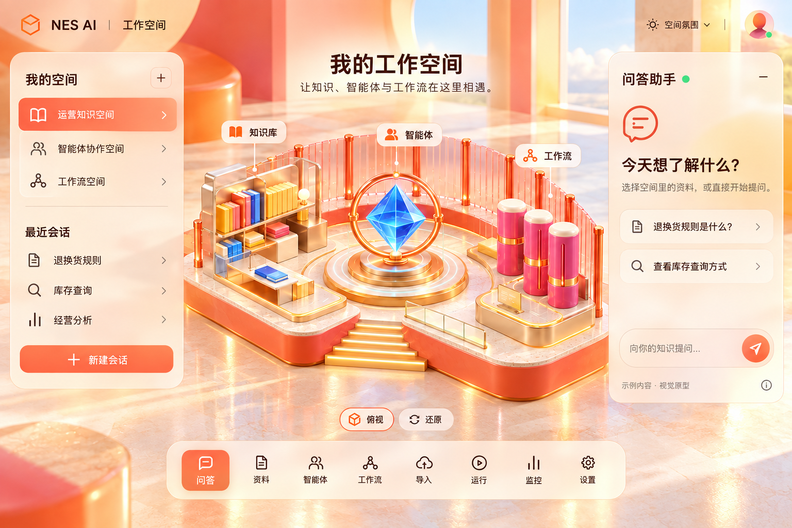

# 选图式前端设计 · Frontend Style Discovery

**先看案例选风格，再把喜欢的部分组合成界面，最后进入开发。**

[English](README.md) · [完整操作流程](docs/WORKFLOW.zh-CN.md) · [宣传视频](media/frontend-style-discovery.mp4)



很多人说不清想要什么设计，却能在具体页面中认出喜欢的部分。这个 skill 让 AI 先找真实案例、生成带编号的选图册，用户选出喜欢的页面并说明原因，再通过多轮搜索和组合逐渐收敛设计。

例如，先选中 KODE、Lusion、Igloo 的 3D 场景和材质，但不喜欢工作台布局；下一轮就寻找空间化应用界面。选定场景与浮窗后，再根据“更明亮、更强烈的暖色碰撞”调整灯光和材质。最后可以把认可的两版合并为可切换主题。

## 适合什么场景

- 不知道如何描述审美，希望直接看 10–20 个真实案例。
- AI 已经做了几版，仍然不是自己想要的界面。
- 喜欢多个作品中的不同部分，希望合理组合。
- 先敲定视觉，再保留现有业务功能完成前端重做。

流程适用于各种前端；本仓库的 3D 空间工作区是示例，不会强迫所有项目使用玻璃、3D 或暖色。

## 安装与调用

```sh
git clone https://github.com/yanghongliang1010-stack/frontend-style-discovery.git
cd frontend-style-discovery
python3 scripts/install-local.py
```

安装器只复制 skill 本体，默认放到 Codex 技能目录，遇到已有同名技能会停止。Python 3.10+ 即可。安装后下一轮对话可用。

```text
用 $frontend-style-discovery 帮我重做前端。
我描述不清想要的风格，先找 10–20 个真实界面让我选。
先设计，选定以后再连接现有功能。
```

之后直接用编号和具体反馈推进：

```text
喜欢 13、17、18 的场景和材质，工作台里没有喜欢的。
```

```text
选 21、22、27、28。保留空间布局，颜色再亮一些，暖色碰撞更鲜明。
```

```text
先用这套。深色和暖色合并为一个，用户可以自行切换主题，然后开始开发。
```

## 选图页怎么用

```sh
python3 skills/frontend-style-discovery/scripts/build_gallery.py examples/demo.json --output out/gallery
python3 -m http.server 8780 --bind 127.0.0.1 --directory out/gallery
```

打开 <http://127.0.0.1:8780/>，按编号选择喜欢／不喜欢，逐张填写理由，筛选方向、放大图片和并排比较。导出的 JSON 可交给 AI，下一轮也可以导入继续使用。选择和备注留在浏览器本地。

示例只包含原创概念图。真实参考的作者链接见 `examples/selected-references.json`；工具不会自行下载、热链或发布作者图片。带本地预览的清单格式见[选图说明](skills/frontend-style-discovery/references/gallery-workflow.md)。

## 看原创 3D 演示与视频

```sh
npm ci
npm run gallery
npm run demo
```

打开 <http://127.0.0.1:8782/demo/>，拖动旋转展亭、切换日光与暮色。视频讲述从选图到设计再到开发的流程，场景、镜头和声音均为原创；创作思路借鉴所选作品的 3D 材质和空间运镜。

视频可重新生成，步骤见[制作说明](docs/VIDEO.md)。skill 和选图工具不需要 Node；只有 3D 演示与视频脚本需要 Node 20+。

## 文件和许可

`skills/frontend-style-discovery/` 是安装包；`examples/` 是原创示例与来源；`demo/` 是真实 3D 演示；`scripts/` 是安装、预览和视频工具；`docs/` 是完整流程、案例与验证。

仓库代码、文档和原创示例采用 MIT。参考作品的版权归作者，不附带第三方截图、模型、音乐或影片；[许可说明](THIRD_PARTY_NOTICES.md)列出使用范围。设计图和演示不代表业务系统已经接入，项目交付仍需实际实现与验证。
