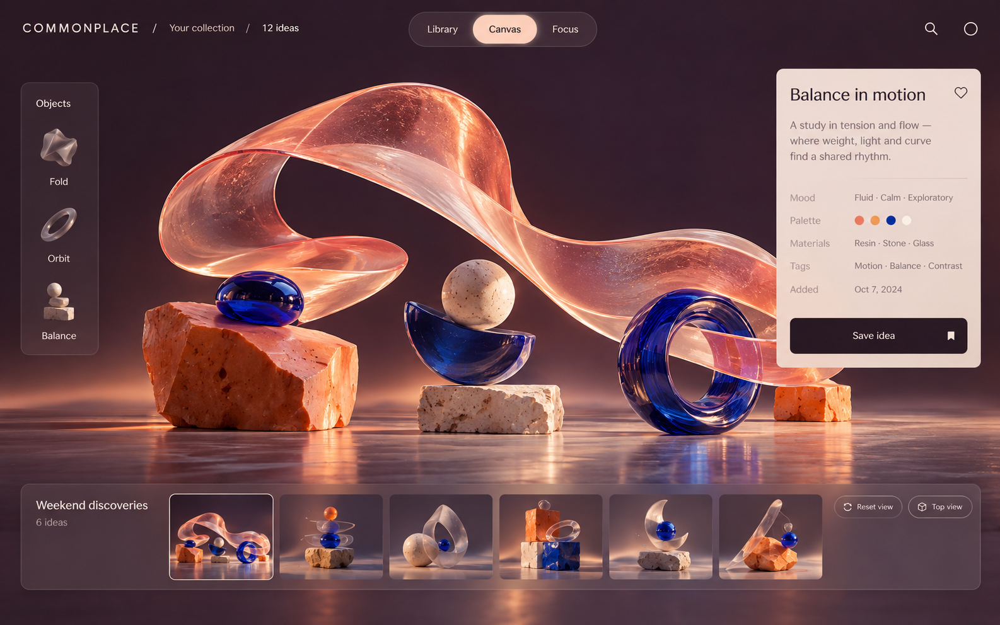

# 独立示例：COMMONPLACE 灵感收藏工具

这是为开源 skill 新制作的虚构案例，不包含任何使用者的项目、业务信息或私有界面。以下反馈是流程演示用的模拟输入，不是实际用户研究结果。

主任务：收藏灵感、浏览收藏、查看单个作品信息。让使用者在杂志式浏览和空间画布之间选择，既保留作品阅读秩序，又允许材质和交互表达。

## 第一轮：先看真正不同的结构

`examples/reference-library.json` 提供 16 个来源入口，覆盖收藏产品、密集工作台、可视化编辑器、互动网站和原生空间设计。清单只附原作链接，核验状态逐项标明；它是研究起点，不能冒充已经完成视觉核验的 16 张截图选图册。

模拟反馈：喜欢 3 Are.na 的收藏思路和 10 Lusion 的材质表达，不喜欢 1 Linear 的任务列表方向。工具保留这些编号，不把“喜欢材质”理解为“照搬整个互动网站”。

## 第二轮：把未决定的结构具体化

新制作两个原创主视图：17 杂志式灵感库、18 空间画布。它们使用同一个虚构产品和主任务，但阅读顺序、空间分配和信息密度明显不同，适合比较结构而非只比较颜色。

`examples/walkthrough/choices.json` 与 `additions.json` 可以实际运行下一轮生成工具，得到已选来源 + 新概念的完整下一轮清单。来源 ID 永不重用；已选项目自动固定；原始理由另存保留。

## 从选择到开发

如果反馈是“用杂志式布局，加上空间画布的玻璃材质”，组合关系应写清楚：17 提供阅读顺序和信息层级，18 提供材料与作品预览交互。再记录字体、颜色、面板、状态、小屏重排及准确的接受指令。选图导出不会自动产生“已批准”。

完整交接模板位于技能的 `references/handoff-template.md`。宣传片中的程序化雕塑是独立动效演示；上面的概念图不是已经接好数据的应用。
